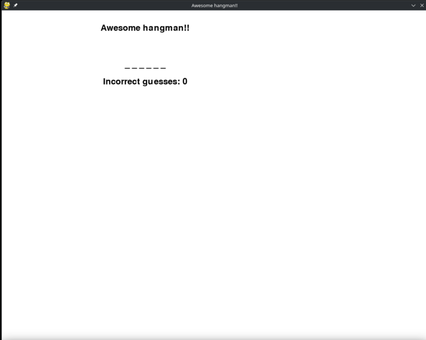

# Python Hangman

This is python hangman made with python and pygame.

To install, copypaste the code and install pygame.

## Play it

How to play it:
1. clone the repo
2. install pygame `pip install pygame` or use requirements.txt (either one)
3. run the python file

